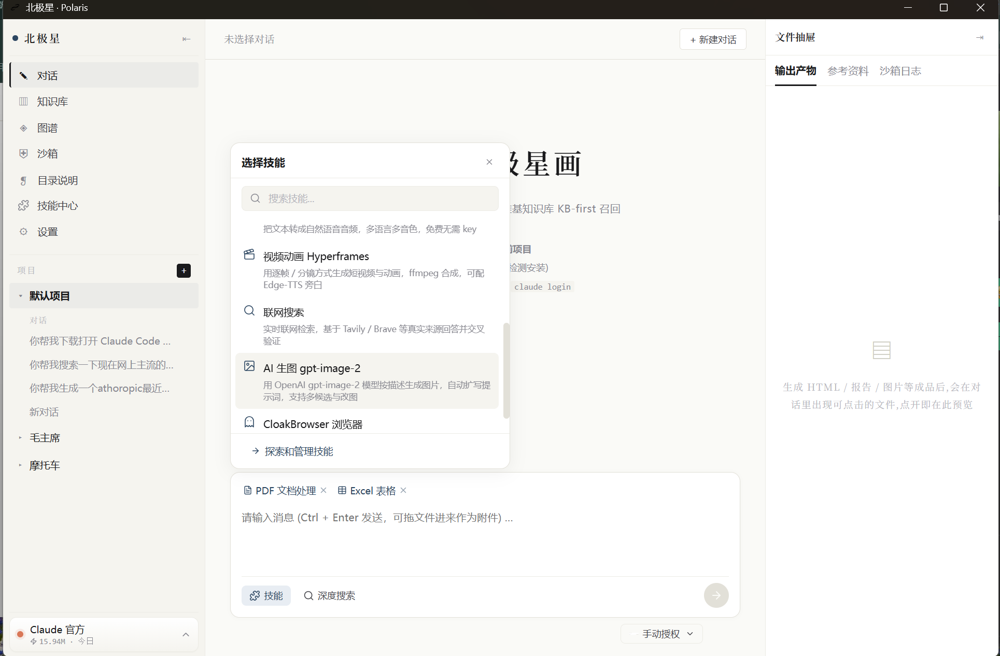
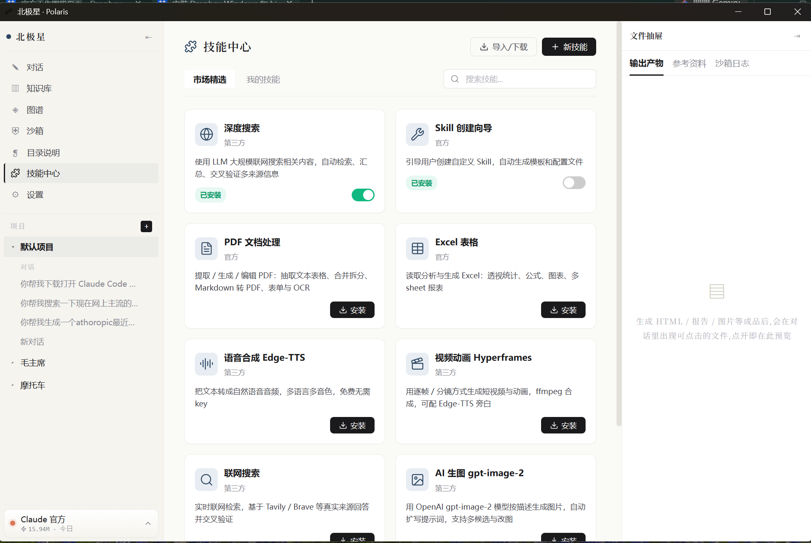
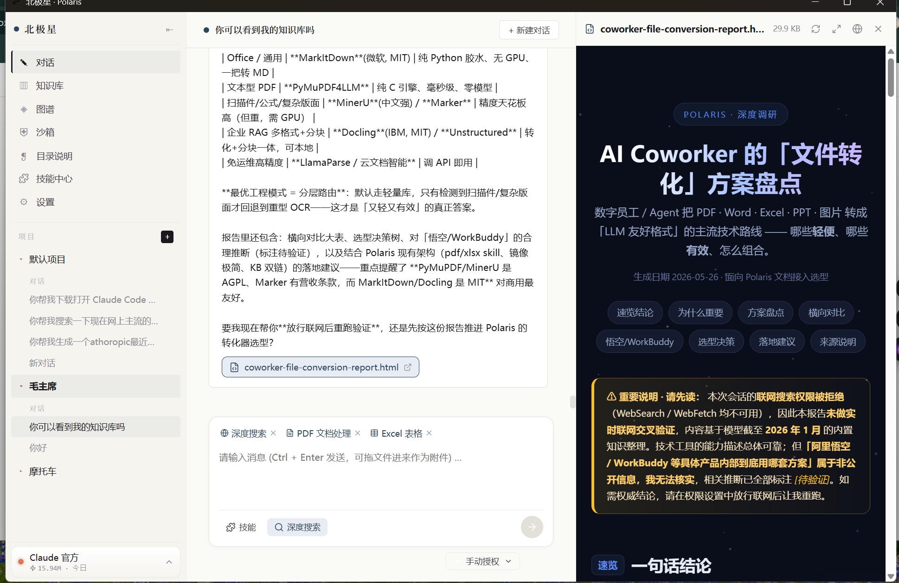
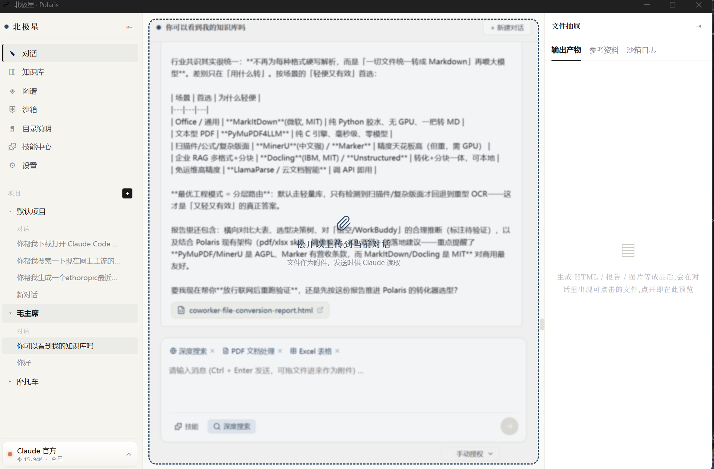
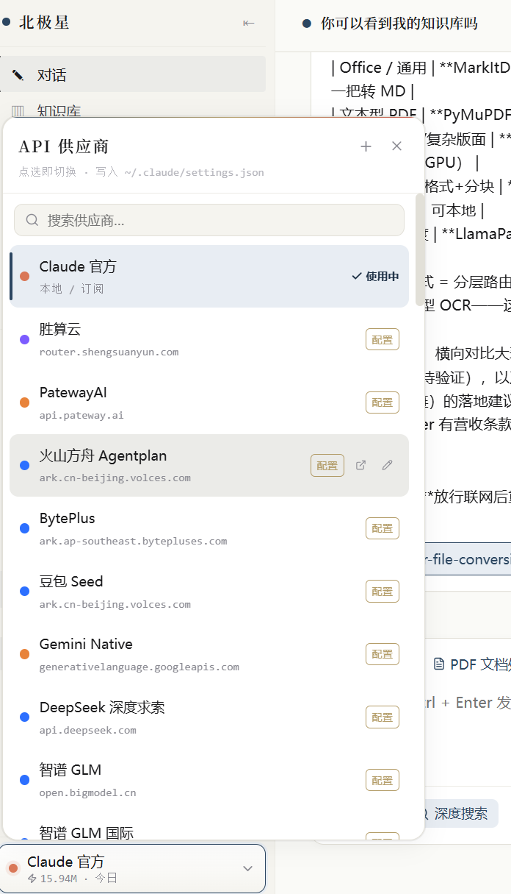
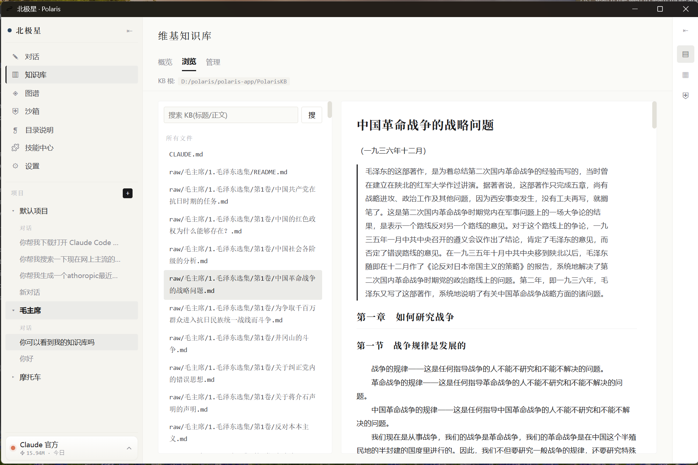
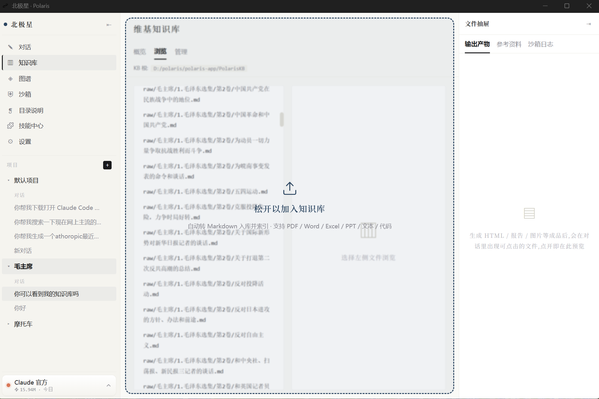
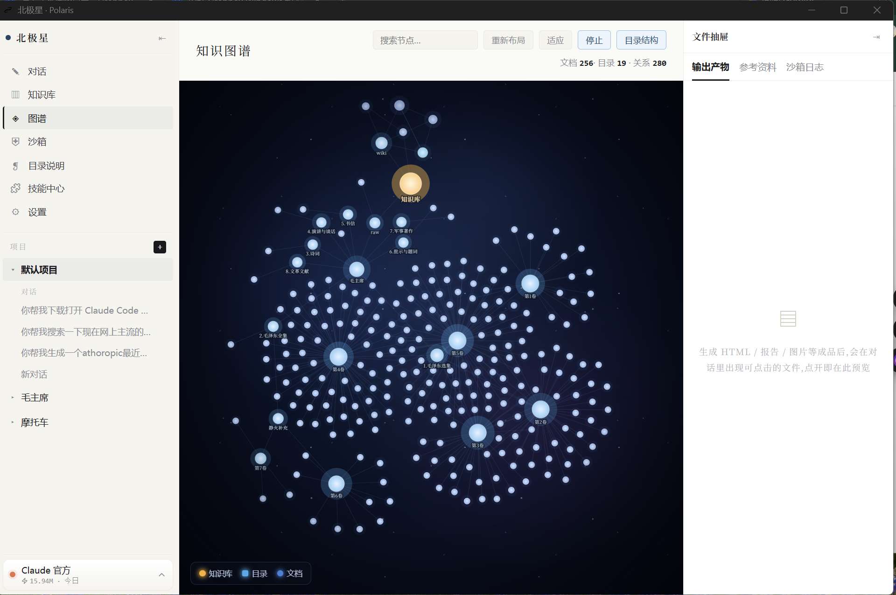
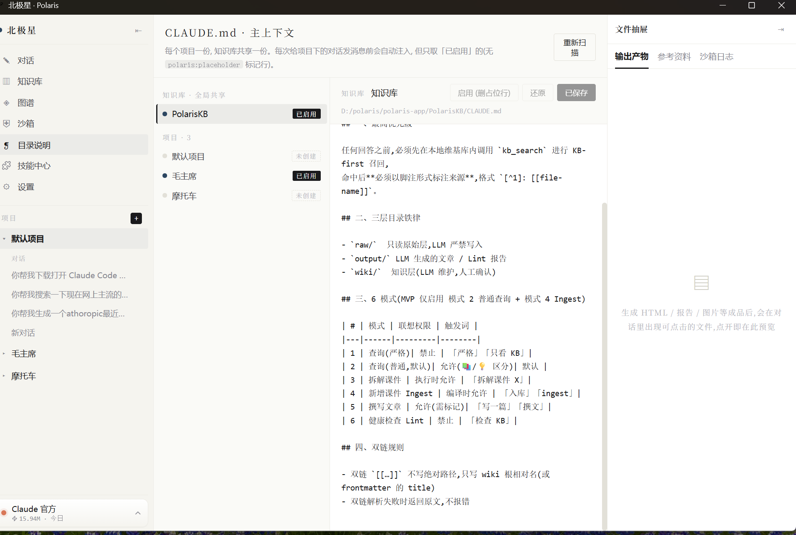

<div align="center">

# 北极星 · Polaris

### 愿北极星能够照亮你前路的所有黑暗，在混乱的时代坚守本心

**本地优先的 AI 工作台** · 墨蓝水墨风 · Tauri 2 + Vue 3 + Rust

</div>

---

## ✨ 这是什么

Polaris 是一个**跑在你自己电脑上**的 AI 工作台。它把 Claude Code 的对话能力、可检索的本地知识库、可插拔的技能系统、多家 API 供应商的一键切换，以及一个 Docker 安全沙箱，收进同一个墨蓝水墨风的桌面应用里。

你的对话、知识、生成的成品，全部安放在本地的「工作文件夹」中——数据始终是你的。

> 启动时会有一页北极星夜空作引，首次使用会引导你安顿好工作文件夹（默认 `~/Polaris/PolarisKB`）。

---

## 🖼 一眼看懂

### 对话核心 · 你说，北极星画

直接驱动 `claude` CLI（宿主或沙箱内），stream-json 流式渲染。底部一行选技能、挂知识库、切四档授权。

<p align="center"></p>

### 技能中心 · 即装即用

深度搜索、Skill 创建向导、PDF / Excel、语音合成、视频动画、联网搜索、AI 生图、CloakBrowser 浏览器……技能即 prompt 注入，支持一键安装与外部导入（git / url / zip）。

<p align="center"></p>

### 成品实时预览

对话生成的 HTML / 图表 / 文档，直接在右侧抽屉渲染，所见即所得。

<p align="center"></p>

### AI 协作伙伴 · WorkBuddy 实战

把一个真实任务交给它——比如「盘点各种文件格式的转化方案」——它会自己检索、整理、交叉验证，并产出一份可直接打开的报告。这才是工作台的意义：不止聊天，而是把活干完。

<p align="center"></p>

### API 供应商坞 · 点选即切换

Claude 官方、智谱、DeepSeek、火山方舟、Gemini、聚合站……点一下即写入 `~/.claude/settings.json` 完成切换，底部实时显示当日用量。

<p align="center"></p>

### 知识库 · 浏览与阅读

知识库里的文档原样渲染阅读，标题、章节、排版一应俱全。搜索走关键词加权评分，标题命中权重最高。

<p align="center"></p>

### 知识库 · 拖拽入库

任意格式直接拖进来——Markdown、Word / Excel / PPT、PDF、网页、图片——自动转成 Markdown 归档到知识库，无需手动转换。

<p align="center"></p>

### 知识图谱 · 星河

本地知识库按双链 `[[wiki-link]]` 与目录层级派生连通，以发光星图呈现，金色星点为知识库根。

<p align="center"></p>

### CLAUDE.md 主上下文

每个项目 + 知识库各持一份 `CLAUDE.md` 主上下文，可视化编辑、按需激活，决定每次对话注入什么。

<p align="center"></p>

---

## 🧩 核心能力

| 模块 | 能力 |
|------|------|
| ① 对话核心 | spawn `claude` CLI（沙箱或宿主），stream-json 流式渲染，四档权限 |
| ② 维基知识库 | 文件扫描 / 关键词加权评分搜索 / 双链图谱（星河）/ 拖拽入库 |
| ③ 技能系统 | 技能=prompt 注入；catalog 预置 + 用户自建 + 外部导入（git/url/zip）|
| ④ API 供应商坞 | 多供应商一键切换（写 `~/.claude/settings.json`）+ 用量看板 |
| ⑤ 安全沙箱层 | 基于 `alpine:3.20` 的轻量镜像（<200MB），docker CLI 包装 |
| ⑥ 文件转换 | 任意格式拖拽 → 转 Markdown 入库 / 作对话附件（`convert.rs`）|
| ⑦ 启动体验 | 北极星启动页 + 首次工作文件夹引导 |

---

## ⚙️ 前置依赖

| 工具 | 用途 |
|------|------|
| Node 20+ | 前端构建 (`npm`) |
| Rust 1.80+ | Tauri 后端 |
| Docker Desktop | 沙箱镜像构建 / 运行（可选）|
| `claude` CLI | 对话核心调用（沙箱内自动装；宿主由「环境医生」一键装，或手动 `npm i -g @anthropic-ai/claude-code --registry=https://registry.npmmirror.com`，国内可装）|

## 🚀 开发模式

```powershell
# 把 cargo 加进 PATH
$env:PATH = "C:\Users\mi\.cargo\bin;$env:PATH"

cd D:\polaris\polaris-app
npm install          # 首次
npm run tauri:dev
```

Vite 端口固定 1420。若被占用先清端口：

```powershell
Get-NetTCPConnection -LocalPort 1420 -ErrorAction SilentlyContinue |
  Select-Object -ExpandProperty OwningProcess | ForEach-Object {
    Stop-Process -Id $_ -Force
  }
```

## 📦 打包安装版

```powershell
npm run tauri:build
```

产物在 `src-tauri/target/release/`：
- `polaris-app.exe` — 免安装可执行文件
- `bundle/nsis/Polaris_<ver>_x64-setup.exe` — NSIS 安装包（开始菜单 + 桌面图标，可在控制面板卸载）

## 📁 文件结构

```
polaris-app/
├── src/                      # Vue 3 前端
│   ├── App.vue               # 三栏 grid 布局 + 启动流程(splash/onboarding)
│   ├── tauri.ts              # 后端 API 包装（浏览器降级 stub）
│   ├── stores/               # Pinia: app / providers / skills / artifacts
│   ├── composables/          # useFileDrop 等
│   └── components/           # Sidebar / ChatPanel / WikiBrowse / KnowledgeGraph
│       │                     #   SkillCenter / ProviderDock / UsageBoard
│       │                     #   ClaudeMdPanel / SplashScreen / Onboarding ...
├── src-tauri/                # Rust 后端
│   ├── src/lib.rs            # 入口 + 命令注册
│   ├── src/kb.rs             # ② 维基知识库
│   ├── src/chat.rs           # ① 对话核心
│   ├── src/skills.rs         # ③ 技能系统
│   ├── src/provider.rs       # ④ 供应商坞 + 用量
│   ├── src/convert.rs        # ⑥ 文件格式转换
│   ├── src/claude_md.rs      # CLAUDE.md 主上下文
│   └── src/templates/        # Dockerfile + KB 骨架 + 技能模板
├── docs/
│   ├── planning/             # 各板块规划 PRD + 实现状态
│   └── screenshots/          # README 截图
└── README.md                 # 本文
```

## 🗺 规划与状态

未实现 / 演进中的板块规划：[`docs/planning/`](./docs/planning/)

## 已知限制

- 索引只在内存，进程重启重扫（待接 SQLite）
- 沙箱 audit 流尚未接入右抽屉「沙箱日志」
- 进程池 / 排队 / 优先级未实现（对话发出即调起一个 claude 进程）
- 浏览器模式（`npm run dev`）只能预览 UI，后端调用走 stub
